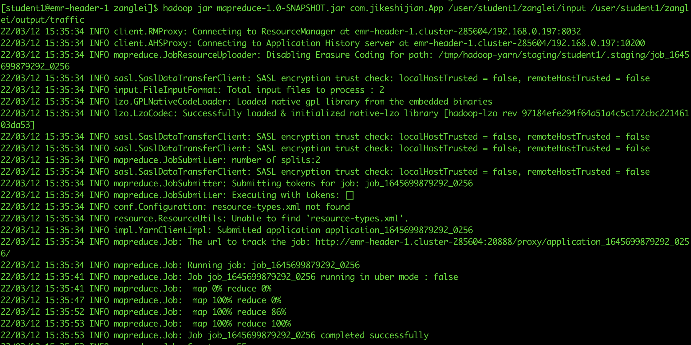

# 主类
com.jikeshijian.App

# jar包存放路径
/home/student1/zanglei

# 数据源hadoop存放路径
/user/student1/zanglei/input

# 结果集hadoop存放路径
/user/student1/zanglei/output/traffic

# jar包执行命令
hadoop jar mapreduce-1.0-SNAPSHOT.jar com.jikeshijian.App /user/student1/zanglei/input /user/student1/zanglei/output/traffic

# 执行结果
